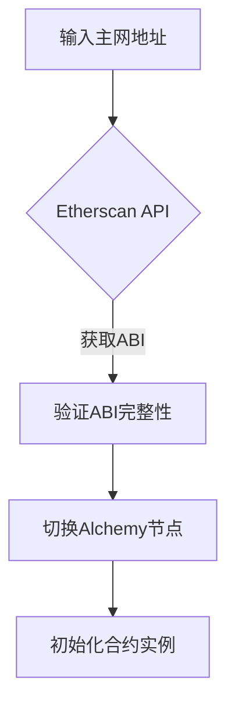

# 智能合约测试工具

基于Python的智能合约交互式测试框架，支持本地开发与主网合约分析

## 🚀 核心功能

### 多模式合约支持
- **Solidity源码编译**  
  `python contract_tester.py --solidity contracts/Example.sol`
- **预编译ABI/BIN加载**  
  `python contract_tester.py --abi build/Example.abi --bin build/Example.bin`
- **主网合约分析**  
  `python contract_tester.py --mainnet 0xdAC1...3ec7`

### 交互式调试
```bash
===== 主菜单 =====
1. 🚀 快速调用模式
2. 📜 查看调用历史  
3. 💰 查看账户余额
4. 🗄️ 读取存储变量
0. 退出
```

### 增强调试能力
- Anvil本地节点集成（自动启动）
- 交易返回值实时解码
- 存储槽直接读写（支持十六进制/十进制）
- 合约状态快照与回滚

## 📦 安装与配置

### 环境要求
- Python 3.8+
- Foundry Anvil (`cargo install --git https://github.com/foundry-rs/foundry anvil`)
- 环境变量文件 `.env`
```bash
ETHERSCAN_API_KEY=your_key_here
ALCHEMY_API_KEY=your_key_here
```

### 快速安装
```bash
git clone https://github.com/your-repo/contract-tester.git
cd contract-tester
pip install -r requirements.txt
```

## 🛠️ 使用指南

### 主网合约分析示例
```bash
# 分析USDT合约
python contract_tester.py --mainnet 0xdAC17F958D2ee523a2206206994597C13D831ec7 --interactive

===== 快速调用模式 ====
> balanceOf 0xf39Fd6e51aad88F6F4ce6aB8827279cffFb92266
✅ 返回值: 1000000000000000000

> allowance 0xf39Fd... 0x70997970C51812dc3A010C7d01b50e0d17dc79C8
🔍 调试返回值: 500000000000000000
```

### 存储操作示例
```bash
===== 存储读取模式 =====
输入存储槽位（十六进制或十进制）: 0x0
存储槽 0x0 的值: 0x000000000000000000000000f39fd6e51aad88f6f4ce6ab8827279cfffb92266
十进制: 1039710615097683402810048858561706201599373243
```

## 🔍 高级功能

### Anvil 集成调试
```python
# 获取Anvil特定返回值
if self._is_anvil():
    return_data = self._get_tx_return_data(tx_hash)
    decoded = self._decode_return_data(return_data, output_types)
    print(f"🔍 调试返回值: {decoded}")
```

### 主网合约加载流程


## 🚨 常见问题

### 错误处理指南
| 错误信息 | 解决方案 |
|---------|----------|
| `Address None must be provided as string` | 检查合约地址是否加载 |
| `Could not transact with contract` | 验证ABI是否包含该函数 |
| `参数转换失败` | 使用明确类型标记如`uint256:100` |

### 性能优化建议
```bash
# 启用Anvil详细日志
anvil --steps-tracing --state-debug
# 并行处理交易
python eval_parallel.py --workers 4
```

## 📚 开发文档

### 核心模块架构
```python
class ContractTester:
    def __init__(self):
        self.w3: Web3  # 节点连接
        self.contract_instance: Contract  # 合约实例
        self.accounts: List[str]  # 测试账户
        
    # 主要方法
    def load_from_mainnet()  # 主网加载
    def _quick_call()       # 快速调用
    def _read_storage()     # 存储操作
```

### 扩展接口示例
```python
class CustomNetworkAdapter:
    def get_abi(self, address):
        """ 实现自定义ABI获取逻辑 """
        return custom_abi
```

## 📜 许可证
MIT License © 2023 [Your Name]  
完整文档见 [docs/](docs/)
